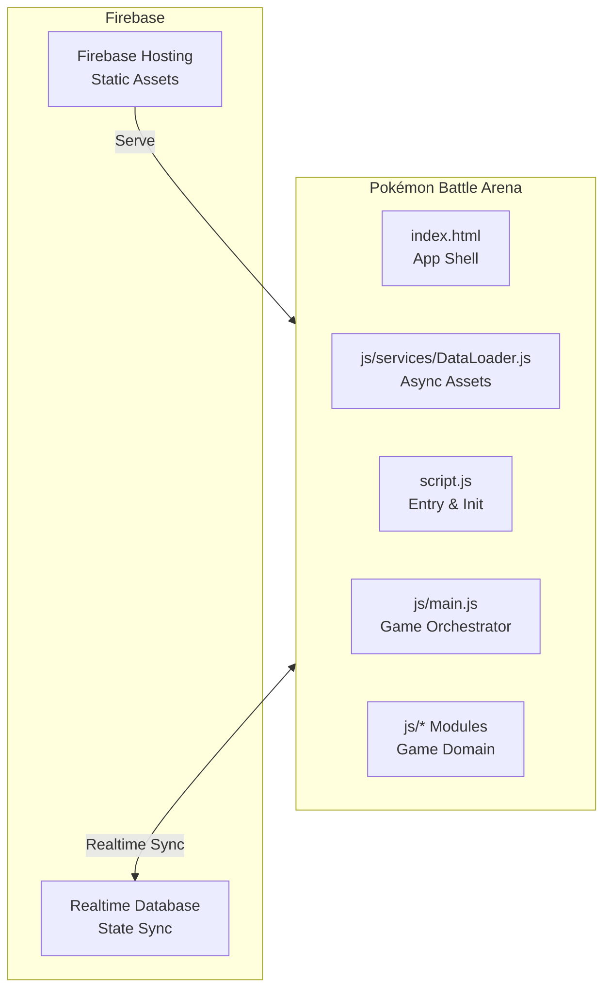

# Pokémon Battle Arena

A real-time multiplayer Pokémon battle simulator built with vanilla JavaScript and Firebase.

**Live Project:** [https://pokemon-1248.web.app](https://pokemon-1248.web.app)

 

<div align="center">
  
</div>

## What it is

You can build a team of six Pokémon, join a room using a simple 6-digit code, and battle your friends in real-time.

The battle engine handles the core mechanics you'd expect from the actual games: type effectiveness, stat modifiers, status conditions (burn, paralysis, poison), and weather effects like sandstorms and hail. Up to six players can connect to the same room. I built the UI using a retro pixel-art style, complete with original sound effects powered by Tone.js.

There's also an undo/redo system that lets you rewind turns during testing—I built this using a custom RingBuffer so it doesn't leak memory if a battle goes on forever.

## Architecture

The stack is a pure static frontend that connects to a serverless **Firebase Realtime Database** for multiplayer synchronization. I stuck to vanilla JS and Tailwind CSS for the client rather than reaching for React or Vue. 

### Frontend and Firebase



### Class Hierarchy

The monolithic code has been refactored into a modular ES6 architecture. The game uses a HashMap for O(1) Pokémon lookups and a Trie to search strings quickly. 

```mermaid
graph TD
    classDef domain fill:#1e3a8a,stroke:#60a5fa,stroke-width:2px,color:#fff;
    classDef service fill:#064e3b,stroke:#34d399,stroke-width:2px,color:#fff;
    classDef infra fill:#701a75,stroke:#f472b6,stroke-width:2px,color:#fff;
    classDef multi fill:#78350f,stroke:#fbbf24,stroke-width:2px,color:#fff;

    subgraph Infrastructure
        PokemonBattleArena[PokemonBattleArena<br/>Main Orchestrator]:::infra
    end

    subgraph Domain Models
        Pokemon[Pokemon<br/>State: HP, stats, types]:::domain
        Player[Player<br/>Trainer data: team]:::domain
        PokemonDatabase[PokemonDatabase<br/>Index + Trie]:::domain
    end

    subgraph Services
        BattleEngine[BattleEngine<br/>Damage Calculation]:::service
        AudioManager[AudioManager<br/>Tone.js wrapper]:::service
        BattleLog[BattleLog<br/>RingBuffer + DOM]:::service
        HistoryManager[HistoryManager<br/>Undo & Redo]:::service
        ModalManager[ModalManager<br/>UI Overlay]:::service
    end

    subgraph Multiplayer
        MultiplayerManager[MultiplayerManager<br/>Firebase RTDB Client]:::multi
    end

    PokemonBattleArena --> Domain Models
    PokemonBattleArena --> Services
    PokemonBattleArena --> Multiplayer
```

## Local Development

Since the game is serverless, you only need to serve the static files:

1. Clone the repository:
```bash
git clone https://github.com/Sapeksh2001/pokemon-battle-arena.git
cd pokemon-battle-arena
```

2. Start a local server:
```bash
npx http-server -p 3000
```

Load `http://localhost:3000` in your browser. Multiplayer works out of the box using the configured Firebase project.

## Development Details

The multiplayer architecture is powered by **Firebase Realtime Database**.
- `createRoom()` defines a new JSON node at `/rooms/<roomId>` and writes the starting configuration.
- `joinRoom()` adds the player to the active participants within the room path.
- Realtime changes are pushed via the `onValue()` and `onChildAdded()` listeners, syncing hit points, weather, and logs seamlessly directly between peer clients.

Damage calculation is faithful to the original games. It factors in attacker level, stat modifiers, Same Type Attack Bonus (STAB), type effectiveness multipliers, and a slight RNG variance.

## Deployment

Because the application is purely static, deploying it is trivial:

1. Configure your Firebase project and paste your `firebaseConfig` object into `js/api/socketClient.js`.
2. Deploy to **Firebase Hosting**:
```bash
npx firebase-tools login
npx firebase-tools deploy
```

## File Breakdown

| Directory/File | Purpose |
|------|---------|
| `/js/models/` | Domain definitions (`Player.js`, `Pokemon.js`) |
| `/js/services/` | Game engines (`BattleEngine.js`, `PokemonDatabase.js`, `DataLoader.js`, etc.) |
| `/js/ui/` | UI and views (`UIRenderer.js`, `ModalManager.js`) |
| `/js/api/` | Real-time networking wrapper (`socketClient.js`) |
| `/js/utils/` | Data structures (`RingBuffer.js`, `Trie.js`) |
| `script.js` | Core UI glue and orchestrator setup |
| `js/main.js` | The `PokemonBattleArena` bootstrap class |
| `style.css` | Animations, colors, retro pixel-art styling |
| `index.html` | Entry point, loader, modals, lobby |

## Roadmap

- Competitive Ranked Mode (Elo/Glicko matchmaking).
- Held items like Leftovers and Choice Band.
- A basic Minimax AI so you can practice offline without juggling tabs.

## License

This project is open-source under the MIT License. Pokémon sprites and audio assets belong to Nintendo and Game Freak.
